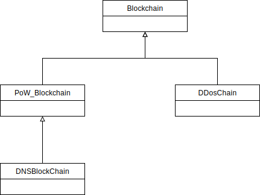

# Blockchain for the project-study

[](https://travis-ci.org/McSido/oth-chain)
[](https://www.codefactor.io/repository/github/mcsido/oth-chain)
[](https://codecov.io/gh/McSido/oth-chain)

---

## Instructions

### Prerequisites

* NaCl (Cryptography)
* PyQT5 (GUI)
* dnslib (DNS-Server)

```SHELL
pip install -r requirements.txt
```

### Setup

1. Clone repo
2. Edit [peers.cfg](./peers.cfg) if needed

## Blockchains

As part of this project different Blockchains have been implemented.  
They all follow the pattern: [Header|Transaction], in which the header usually contains information such as version/index/timestamp/previous_hash/root_hash and the transactions information about the sender/receiver as well as a signature for the transaction.

The inheritance is as follows:



## Proof-of-Work Blockchain

### Description

This Blockchain is built to show the basic principles of a public Blockchain. It uses a proof-of-work algorithm to prevent tampering. Popular Blockchains such as Bitcoin and Ethereum were used as basis for design decisions.

In this blockchain coins can be sent between accounts.  
The mining works by trying to find a solution in which `hash(last_block.proof,proof,miner_key)` starts with as many 0 as described by the difficulty. The difficulty increases as time goes on. The hashing algorithm used is _sha256_.  
For the mining of a valid block, `50 >> 2 ** reward_multiplicator` coins will be rewarded to the miner. By setting the reward_multiplicator to `math.floor(block.header.index / 10) - 1` the mining reward becomes smaller until it reaches 0, at this point no more coins will be created. The mining compensation at that points happens via transaction fees.

### Usage

 Start multiple [oth-chain/core.py](./oth-chain/core.py) with --port=\<PORT> (Standard port=6666)

### Commands

**help**: prints commands\
**transaction \<to> \<amount>** : Create transaction  
**mine**: mine a new block  
**balance [\<name>]**: Print balance (name optional)  
**dump**: print blockchain  
**peers**: print peers  
**key \<filename>** : Save current key to \<filename>  
**import \<key> \<name>** : Imports a public key associated with \<name> from file \<file> to the keystore  
**deletekey \<name>** : Deletes key associated with \<name> from keystore  
**export \<filename>** : Exports one own public key to file \<filename>  
**gui**: Open GUI  
**save**: Save blockchain to bc_file.txt  
**exit**: exits program

### Options

```SHELL
-p --port=<PORT>   Change port (default is 6666)
-k --key=<PATH>    Load private key from file
-s --store=<PATH>  Sets the name of the keystore file for saving and loading the keystore, defaults to 'keystore'
-d --debug         Activate debug prints
-n --dns           Start DNS-Blockchain
```

## DNS Blockchain

The DNS blockchain is split into the basic node functionality and a DNS-Server.

### Description - Node

This blockchain allows for storage/transfer/auction of DNS records.  
It is built on top of the [Proof-of-Work Blockchain](#Proof-of-Work-Blockchain) and therefore allows for the same functionality with dns added on top.  
The auction mechanism works as follows:

1. User opens auction for domain
2. Other users can bid on the domain
3. After 5 blocks the domain will transfer to the highest bidder

### Usage - Node

 Start multiple [oth-chain/core.py](./oth-chain/core.py) with --dns --port=\<PORT> (Standard port=6666)

### Commands - Node

Additionally to the [commands](#Commands) of the [Proof-of-Work Blockchain](#Proof-of-Work-Blockchain):

**register \<domain> \<ip>**: Registers an available domain to an IP (costs 20 coins)  
**update \<domain> \<ip>** : Updates an existing already owned domain with a new IP (costs 20 coins)  
**transfer \<to> \<domain>** : Transfers an owned domain to another user (costs 1 coin)  
**auction \<domain>** : Offers an owned domain for auction (costs 1 coin)  
**bid \<amount> \<domain>** : Places a bid of \<amount> on the auctioned domain.  
**resolve \<domain>** : Resolves the domain name and prints the IP (if the domain does not exist, prints '')  

### Description - Server

Besides the blockchain node there exists a DNS-Server that uses the blockchain data and makes them available just like any other DNS-Server.  
The dnslib-package was used to provide the implementation of the DNS protocol.

### Usage - Server

Point the Server towards a DNS node (via peers.cfg).
Start [oth-chain/dns_server.py](./oth-chain/dns_server.py) with --port=\<PORT> (Standard port=6666).
Test with `nslookup` to see if it is working.

### Options - Server

```SHELL
-p --port=<PORT>   Change port (default is 6666)
-d --debug         Activate debug prints
```

## DDoS Blockchain

### Description - DDoS

This is a private Blockchain used to store malicious IP's that were part of a DDoS attack.
The idea behind this is that organization/individuals that trust each other can share this information and gain an advantage against a potential attack.  

With this being a private chain there are some differences compared to the before mentioned public blockchains.

1. No proof algorithm (like proof-of-work) is needed
2. Some trust between the participants is needed

To make the blockchain private, we built an invite system in which only transactions of someone invited to it are accepted. There is one fixed key that acts as the initial account.  
To reduce trust/knowledge between the participants of the blockchain to a minimum while also maintaining security, we store the access data in a tree data structure. Which means every invitee is added as a child node of the account that invited them.  
An account can un-invite any of it's descendants, as well as change the block status of their IPs.

The advantages of this system can be easily seen in the following example:

```PSEUDO
  A
 / \
B   C
```

In this case B does not need to know anything about C, but can still trust its information.  
If one of them tries to harm the system, A can step in and remove their access as well as purge their data.

### Usage - DDos

1. Start [oth-chain/ddos_core.py](./oth-chain/ddos_core.py) with --port=\<PORT> (Standard port=6666).
2. Give a member of the blockchain your public key (Print with: `public`)
3. Interact with the blockchain

### Commands - DDoS

**help**: prints commands  
**dump**: print blockchain  
**peers**: print peers  
**exit**: exits program  
**key \<filename>** : Save current key to \<filename>  
**export \<filename>** : Exports one own public key to file \<filename>  
**blocked:** print blocked IPs  
**invite \<pub-key>** : Invite owner of \<pub-key> into the chain  
**uninvite \<pub-key>** : Remove owner of \<pub-key> from the chain  
**block \<ip>** : Add IP to the list of blocked IPs  
**unblock \<ip>** : Remove IP from the list of blocked IPs  
**purge \<pub-key>**: Remove owner of the \<pub-key> and unblock all of their blocked IPs  
**children**: print all descendants  
**public**: print public key  
**exit**: exits program  

### Options - DDoS

```SHELL
-p --port=<PORT>   Change port (default is 6666)
-d --debug         Activate debug prints
-k --key=<PATH>    Load private key from file
```

## Structure

### [chains](./oth-chain/chains)

This modules contains all different blockchain implementations.

### [gui](./oth-chain/gui)

This module contains the GUI for the blockchains.  
The GUI is a QT application, written with pyqt5.

### [networking](./oth-chain/networking)

This module contains everything needed for the P2P communication for the blockchains.  
The communication happens via an extended UDP protocol, which allows for rebuilding of split packages.

### [serializer](./oth-chain/serializer)

This module is used to (de)serialize the data used in the blockchains.  
JSON is used as a data format.  
[Further information](./documentation/protocol.md)

### [utils](./oth-chain/utils)

This module contains the utility functionality used in the blockchains:

* **keystore**: Store for public keys of other accounts for easier use
* **node**: Tree structure used for the access hierarchy of the DDoS-chain
* **utils**: Additional utility functions (e.g. print_debug)

## Internal communication

Internal communication (between threads) of the blockchain is handled via Queues


## Networking protocol

Messages are serialized as JSON \
Messages contain a message-type and message-data \
[Further information](./documentation/protocol.md)

## [Tests](./oth-chain/tests)

For testing run pytest -v
