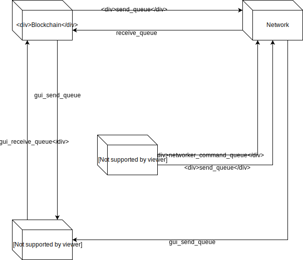

# Blockchain for the project-study

## Instructions

### Prerequisites

* NaCl (Cryptography)\
 `pip install pynacl`

### Setup

1. Clone repo
2. Edit [peers.cfg](./peers.cfg) if needed
3. Start multiple [core.py](./core.py) with --port=\<PORT> (Standard port=6666)

### Commands

**help**: prints commands\
**transaction \<to> \<amount>** : Create transaction \
**mine**: mine a new block \
**balance [\<name>]**: Print balance (name optional) \
**dump**: print blockchain \
**peers**: print peers \
**key \<filename>** : Save current key to \<filename>\
**import \<key> \<name**> : Imports a public key associated with \<name> from file \<file> to the keystore\
**deletekey \<name>** : Deletes key associated with \<name> from keystore\
**export \<filename>** : Exports one own public key to file \<filename>\
**gui**: Open GUI\
**save**: Save blockchain to bc_file.txt\
**exit**: exits programm

### Options

```
-p --port=<PORT>   Change port (default is 6666)
-k --key=<PATH>    Load private key from file
-s --store=<PATH>  Sets the name of the keystore file for saving and loading the keystore, defaults to 'keystore'
-d --debug         Activate debug prints
```

## Information

### Components

#### [blockchain.py](./blockchain.py)

Contains an abstract class of a blockchain \
Current implementations:

* [pow_chain.py](./pow_chain.py)

A Proof-of-Work blockchain that uses sha256 as the hashing-algorithm \
Basic functionality implemented

#### [networking.py](./networking.py)

Responsible for all parts of the networking/P2P aspect of the blockchain \
Uses UDP packages

#### [core.py](./core.py)

Start of the blockchain \
Responsible for the setup of the blockchain and networking system \
CLI loop

### Internal communication

Internal communication (between threads) of the blockchain is handled via two Queues \


### Networking protocol

Messages are serialized via pythons _pickle_ module \
Messages contain a message-type and message-data

### Tests

For testing run py.test -v\
Additional stress-tests are in  [stress_test.py](./stress_test.py)