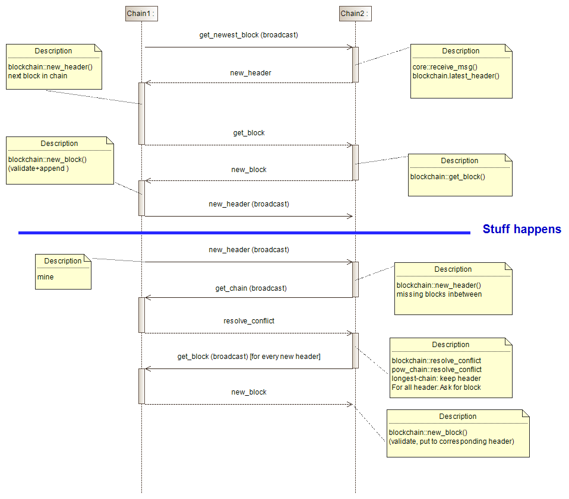

# OTH-Chain protocol description

## Communication protocol

The communication between two different blockchain clients happens as follows:


## Data format

All the data send between nodes is serialized as JSON.

The data usually follows this pattern:

```JSON
        __type__: <Type of data>
        __data__: <Data content>
```

### Exceptions

* Block

```JSON
        __type__: <Type of data>
        __header__: <Header>
        __transactions__: <Transactions>
```

* Tuple/List

```JSON
        __type__: <Tuple|List>
        __<Index>__: <Data at index>
```

* Dict

```JSON
        __type__: 'Dict'
        __<key>__: <Data at key>
```

* Bytes (current Codec: utf-8)

```JSON
        __type__: 'Bytes'
        __encoding__: <Codec>
        __data__: <Decoded data content>
```

* Hex-Bytes (Used for NaCl Keys/Signatures)  

Data is encoded(nacl.encoding.HexEncoder) before decoding with codec

```JSON
        __type__: 'Hex-Bytes'
        __encoding__: <Codec>
        __data__: <Decoded data content>
```

* SigningKey  

Data is encoded(nacl.encoding.HexEncoder) before decoding with codec

```JSON
        __type__: 'SigningKey'
        __encoding__: <Codec>
        __seed__: <Decoded seed of the key>
```